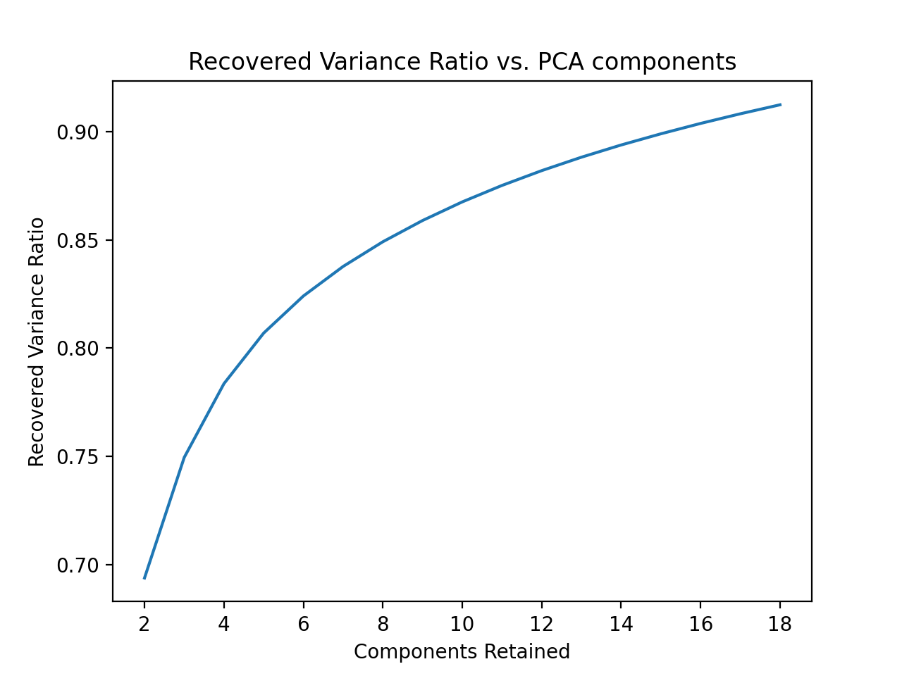
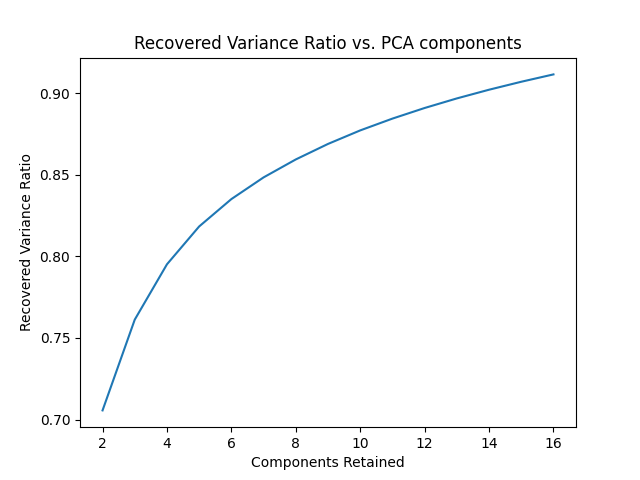
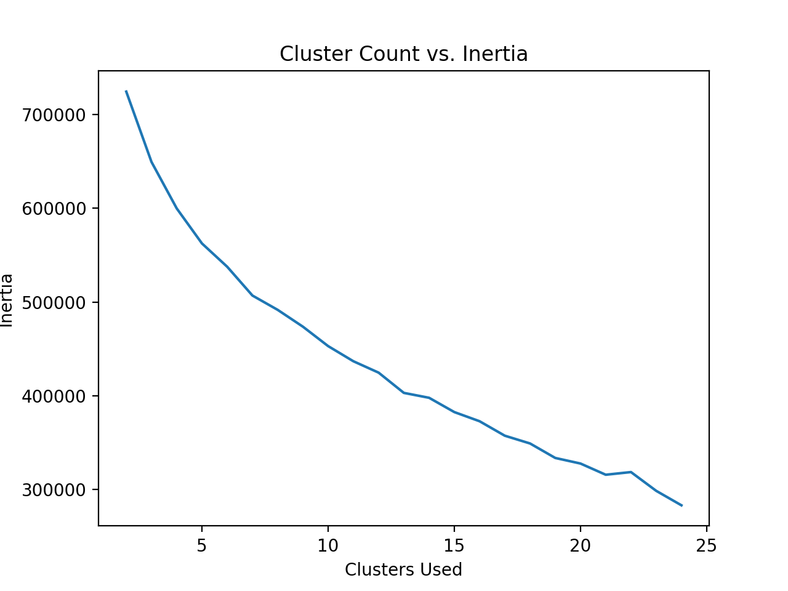
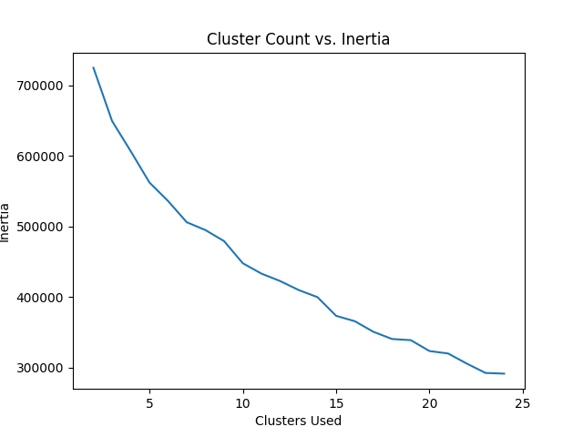

# Outfit Recommender
Group 40's CS 4641 Project: a clothing recommendation system.

Project by: Jackson Isenberg, Rishabh Jain, Rahi Kotadia, Adithya Vasudev, and Vivek Vijaykumar

Video Link: https://www.youtube.com/watch?v=y5HWehGLPQU

Website Link: https://adithya-gv.github.io/outfit-recommender/

## Introduction
Clothing shopping is a frequent occurrence, yet it remains a difficult and personal decision. Given our history of shopping and the characteristics of clothing items, we believe that automation and machine learning have the power to boost our decision making. There are many technologies targeting the fashion industry, usually leveraging data about customer habits and product appearances to make smart recommendations. 

### Background
Recommendation systems using visual, linguistic, or tabular data are a well-researched area. The popular approach is image-centric. This entails incorporating color, shape, and other visual cues to recommend either similar clothing or complementary pieces of fashion to a given product via Neural Networks [1,2]. Another popular technique utilizes NLP (Natural Language Processing) to help identify, cluster, and recommend clothing based on the names and descriptions of various products [3]. Other sources have worked with multi-label classification for clothing or data from professional stylists to better recommend specific clothing fashion to customers [4], but these diverge from our main focus.

## Problem Statement

### Motivation
The motivation of our project is to bring recommendation system algorithms to an area of shopping that is highly personal and varied: clothes shopping. A secondary motivation was to go beyond simple analysis of purchasing data and use data intrinsic to the clothing and users to provide recommendations that target the user's specific features.

### Our Problems

Our problem is twofold. 
1. Measure the similarity between two arbitrary pieces of clothing and use this measurement to construct groupings of similar clothings. 
2. Construct a recommender system that will recommend clothing based on a user's purchase history. 

## Dataset Overview
The dataset we plan to use is the H&M clothing purchase history dataset (https://www.kaggle.com/c/h-and-m-personalized-fashion-recommendations/overview). The dataset has over 1 million logged clothing transactions, each attributed to a given ID representing a distinct person. The dataset also has metadata for clothing and images of each clothing item. However, the dataset is extremely large and it would not be viable to run all of our models on the entirety of the data due to our computation limitations. Because of this, we have limited the dataset to around the first 35,000 of the 100,000 images of clothing. Since the entire dataset is split into 95 folders each of which have a random sample of 
clothing variants, 35% of this dataset should ensure that we have every possible type of clothing to successfully build our model. 

## Intended Methods
Each of the two subproblems within our overall problem has distinct approaches.

### Clothing Similarity

#### Data Pre-Processing
First, we selected a sample of 35,000 images from the dataset. Because images have vastly more features than we have computational power to process through, we used PCA to compress the images. We determined the number of features by choosing the minimal number of features needed to have 90% of recovered variance. We do this twice: once in grayscale and once in RGB. 

#### Clustering and Labelling
We measured clothing similarity by applying a clustering algorithm over the features of each clothing item. We applied two clustering algorithms, K-Means Clustering and Agglomerative Clustering, to see which captures the shape of the data the best. 

First, we used the Elbow method on K-means to determine the optimal number of clusters. We used the distortion score (or Inertia, as Scikit Learn calls it) to evaluate the elbow.

Next, to evaluate which metric was better, we used two Clustering Evaluation Techniques, the Davies-Bouldin Index and Sillhouette Score. We ran each clustering algorithm 10 times on the same dataset to determine average values for each.

### Recommender System
To create the clothing recommender system, we plan to test a variety of popular approaches. The two front-runners for our recommender system so far are an artificial neural network, and a support vector machine. 

## Results and Discussion: Similarity Clustering
For the clustering part of the project, PCA was run on both RGB and grayscale images on around 30,000 images. The PCA image compression on RGB images resulted in 16 features used from the image to recover 90% accuracy, as shown in Figure 1.

The PCA image compression on grayscale images also resulted in 16 features used from the image to recover at least 90% variance, as shown in Figure 2.

K-means was run on 200 RGB images in order to generate a graph of inertia versus cluster count, as shown below. 

Based on the elbow curve, we decided to use 13 clusters as our optimal cluster count.

K-means with 13 clusters was then run for RGB images to generate labels for each datapoint. Agglomerative clustering was also run with 13 clusters and 16 features for images to generate equivalent labels.

K-means was then run on 200 grayscale images in order to generate a graph of inertia versus cluster count, as shown below. 

K-means with 15 clusters was then run for RGB images. The number of clusters may be higher because the features take into account the shape of the article of clothing more in PCA when the image is grayscale versus when the image is in RGB. The RGB clusters may have more similarity in color, but the grayscale may have more similarity in shape.

Finally, when picking between K-Means Clustering and Agglomerative Clustering, we compared the Davies-Bouldin Index and Sillhouette Scores for both algorithms.
For K-Means, we recieved an average Davies-Bouldin Index of 1.61, and an average Sillhouette Score of 0.21. 
For Agglomerative Clustering, we recieved an average Davies-Bouldin Index of 1.54, and an average Sillhouette Score of 0.26.
Therefore, we decided to use Agglomerative Clustering's labels for its superior performance in both metrics (lower Davies-Bouldin Index and higher Sillhouette Score), as well as its extremely low run-to-run variance. 

## Potential Results and Discussion: Recommender System
The recommendation system should be able to take in a customer's purchase history of clothing and recommend items for them to purchase based on similarity with prior purchases and potential matches. 

## References

1.  "Aesthetic-based Clothing Recommendation" (https://arxiv.org/pdf/1809.05822.pdf)  - International World Wide Web Conference (WWW)
2. "Image Based Fashion Product Recommendation with Deep Learning" (https://arxiv.org/pdf/1805.08694.pdf) 
3. "Towards Fashion Recommendation: An AI System for Clothing Data Retrieval and Analysis" (https://www.ncbi.nlm.nih.gov/pmc/articles/PMC7256565/) - IFIP International Conference on Artificial Intelligence Applications and Innovations (AIAI)
4. "Understanding Professional Fashion Stylists’ Outfit Recommendation Process: A Qualitative Study" (https://www.researchgate.net/publication 350315907_Understanding_Professional_Fashion_Stylists'_Outfit_Recommendation_Process_A_Qualitative_Study)

## Timeline

<table class="tg">
<thead>
  <tr>
    <th class="tg-0pky">GANTT CHART</th>
    <th class="tg-0pky"> </th>
    <th class="tg-c3ow"> </th>
    <th class="tg-c3ow"> </th>
    <th class="tg-c3ow"> </th>
  </tr>
</thead>
<tbody>
  <tr>
    <td class="tg-0pky"> </td>
    <td class="tg-0pky"> </td>
    <td class="tg-0pky"> </td>
    <td class="tg-0pky"> </td>
    <td class="tg-c3ow"> </td>
  </tr>
  <tr>
    <td class="tg-dvpl">PROJECT TITLE</td>
    <td class="tg-0pky">Outfit Recommender Project Timeline</td>
    <td class="tg-0pky"></td>
    <td class="tg-0pky"></td>
    <td class="tg-0pky"> </td>
  </tr>
  <tr>
    <td class="tg-0pky"> </td>
    <td class="tg-0pky"> </td>
    <td class="tg-0pky"> </td>
    <td class="tg-0pky"> </td>
    <td class="tg-c3ow"> </td>
  </tr>
  <tr>
    <td class="tg-0pky"></td>
    <td class="tg-0pky"></td>
    <td class="tg-0pky"></td>
    <td class="tg-0pky"></td>
    <td class="tg-0pky"></td>
  </tr>
  <tr>
    <td class="tg-c3ow">TASK TITLE</td>
    <td class="tg-c3ow">TASK OWNER</td>
    <td class="tg-c3ow">START DATE</td>
    <td class="tg-c3ow">DUE DATE</td>
    <td class="tg-c3ow">DURATION</td>
  </tr>
  <tr>
    <td class="tg-c3ow"></td>
    <td class="tg-c3ow"></td>
    <td class="tg-c3ow"></td>
    <td class="tg-c3ow"></td>
    <td class="tg-c3ow"></td>
  </tr>
  <tr>
    <td class="tg-0pky">Project Team Composition</td>
    <td class="tg-0pky">All</td>
    <td class="tg-c3ow">1/17/22</td>
    <td class="tg-c3ow">2/1/22</td>
    <td class="tg-c3ow">14</td>
  </tr>
  <tr>
    <td class="tg-0pky">PROJECT PROPOSAL</td>
    <td class="tg-0pky"> </td>
    <td class="tg-0pky"> </td>
    <td class="tg-0pky"> </td>
    <td class="tg-0pky"> </td>
  </tr>
  <tr>
    <td class="tg-0pky">Introduction &amp; Background</td>
    <td class="tg-0pky">Vivek, Adithya</td>
    <td class="tg-c3ow">2/2/22</td>
    <td class="tg-c3ow">2/24/22</td>
    <td class="tg-c3ow">22</td>
  </tr>
  <tr>
    <td class="tg-0pky">References</td>
    <td class="tg-0pky">Vivek</td>
    <td class="tg-c3ow">2/2/22</td>
    <td class="tg-c3ow">2/24/22</td>
    <td class="tg-c3ow">22</td>
  </tr>
  <tr>
    <td class="tg-0pky">Problem Definition</td>
    <td class="tg-0pky">Rahi</td>
    <td class="tg-c3ow">2/2/22</td>
    <td class="tg-c3ow">2/24/22</td>
    <td class="tg-c3ow">22</td>
  </tr>
  <tr>
    <td class="tg-0pky">Timeline</td>
    <td class="tg-0pky">Rishabh/Rahi</td>
    <td class="tg-c3ow">2/2/22</td>
    <td class="tg-c3ow">2/24/22</td>
    <td class="tg-c3ow">22</td>
  </tr>
  <tr>
    <td class="tg-0pky">Methods</td>
    <td class="tg-0pky">Adithya</td>
    <td class="tg-c3ow">2/2/22</td>
    <td class="tg-c3ow">2/24/22</td>
    <td class="tg-c3ow">22</td>
  </tr>
  <tr>
    <td class="tg-0pky">Potential Dataset</td>
    <td class="tg-0pky">Vivek</td>
    <td class="tg-c3ow">2/2/22</td>
    <td class="tg-c3ow">2/24/22</td>
    <td class="tg-c3ow">22</td>
  </tr>
  <tr>
    <td class="tg-0pky">Potential Results &amp; Discussion</td>
    <td class="tg-0pky">Rishabh</td>
    <td class="tg-c3ow">2/2/22</td>
    <td class="tg-c3ow">2/24/22</td>
    <td class="tg-c3ow">22</td>
  </tr>
  <tr>
    <td class="tg-0pky">Video Creation &amp; Recording</td>
    <td class="tg-0pky">Jackson</td>
    <td class="tg-c3ow">2/2/22</td>
    <td class="tg-c3ow">2/24/22</td>
    <td class="tg-c3ow">22</td>
  </tr>
  <tr>
    <td class="tg-0pky">GitHub Page</td>
    <td class="tg-0pky">Adithya</td>
    <td class="tg-c3ow">2/2/22</td>
    <td class="tg-c3ow">2/24/22</td>
    <td class="tg-c3ow">22</td>
  </tr>
  <tr>
    <td class="tg-0pky">MIDTERM REPORT</td>
    <td class="tg-0pky"> </td>
    <td class="tg-0pky"> </td>
    <td class="tg-0pky"> </td>
    <td class="tg-0pky"> </td>
  </tr>
  <tr>
    <td class="tg-0pky">Clustering Algorithm Selection (M1)</td>
    <td class="tg-0pky">All</td>
    <td class="tg-c3ow">2/25/22</td>
    <td class="tg-c3ow">2/28/22</td>
    <td class="tg-c3ow">3</td>
  </tr>
  <tr>
    <td class="tg-0pky">M1 Data Cleaning</td>
    <td class="tg-0pky">Rahi</td>
    <td class="tg-c3ow">2/25/22</td>
    <td class="tg-c3ow">3/4/22</td>
    <td class="tg-c3ow">9</td>
  </tr>
  <tr>
    <td class="tg-0pky">M1 Data Visualization</td>
    <td class="tg-0pky">Rishabh</td>
    <td class="tg-c3ow">2/25/22</td>
    <td class="tg-c3ow">3/4/22</td>
    <td class="tg-c3ow">9</td>
  </tr>
  <tr>
    <td class="tg-0pky">M1 Feature Reduction</td>
    <td class="tg-0pky">Jackson</td>
    <td class="tg-c3ow">2/25/22</td>
    <td class="tg-c3ow">3/4/22</td>
    <td class="tg-c3ow">9</td>
  </tr>
  <tr>
    <td class="tg-0pky">M1 Implementation &amp; Coding</td>
    <td class="tg-0pky">Adithya</td>
    <td class="tg-c3ow">3/5/22</td>
    <td class="tg-c3ow">3/14/22</td>
    <td class="tg-c3ow">9</td>
  </tr>
  <tr>
    <td class="tg-0pky">M1 Results Evaluation</td>
    <td class="tg-0pky">All</td>
    <td class="tg-c3ow">3/15/22</td>
    <td class="tg-c3ow">3/18/22</td>
    <td class="tg-c3ow">3</td>
  </tr>
  <tr>
    <td class="tg-0pky">Recommendation Alg Selection (M2)</td>
    <td class="tg-0pky">All</td>
    <td class="tg-c3ow">2/25/22</td>
    <td class="tg-c3ow">2/28/22</td>
    <td class="tg-c3ow">3</td>
  </tr>
  <tr>
    <td class="tg-0pky">M2 Data Cleaning</td>
    <td class="tg-0pky">Vivek</td>
    <td class="tg-c3ow">3/19/22</td>
    <td class="tg-c3ow">4/4/22</td>
    <td class="tg-c3ow">15</td>
  </tr>
  <tr>
    <td class="tg-0pky">M2 Data Visualization</td>
    <td class="tg-0pky">Rishabh</td>
    <td class="tg-c3ow">3/19/22</td>
    <td class="tg-c3ow">4/4/22</td>
    <td class="tg-c3ow">15</td>
  </tr>
  <tr>
    <td class="tg-0pky">M2 Feature Reduction</td>
    <td class="tg-0pky">Adithya</td>
    <td class="tg-c3ow">3/19/22</td>
    <td class="tg-c3ow">4/4/22</td>
    <td class="tg-c3ow">15</td>
  </tr>
  <tr>
    <td class="tg-0pky">Midterm Report</td>
    <td class="tg-0pky">All</td>
    <td class="tg-c3ow">3/19/22</td>
    <td class="tg-c3ow">4/5/22</td>
    <td class="tg-c3ow">16</td>
  </tr>
  <tr>
    <td class="tg-0pky">FINAL REPORT</td>
    <td class="tg-0pky"> </td>
    <td class="tg-0pky"> </td>
    <td class="tg-0pky"> </td>
    <td class="tg-0pky"> </td>
  </tr>
  <tr>
    <td class="tg-0pky">M2 Coding &amp; Implementation</td>
    <td class="tg-0pky">Jackson</td>
    <td class="tg-c3ow">4/5/22</td>
    <td class="tg-c3ow">4/19/22</td>
    <td class="tg-c3ow">14</td>
  </tr>
  <tr>
    <td class="tg-0pky">M2 Results Evaluation</td>
    <td class="tg-0pky">All</td>
    <td class="tg-c3ow">4/20/22</td>
    <td class="tg-c3ow">4/21/22</td>
    <td class="tg-c3ow">1</td>
  </tr>
  <tr>
    <td class="tg-0pky">M1-M3 Comparison</td>
    <td class="tg-0pky">All</td>
    <td class="tg-c3ow">4/22/22</td>
    <td class="tg-c3ow">4/24/22</td>
    <td class="tg-c3ow">2</td>
  </tr>
  <tr>
    <td class="tg-0pky">Video Creation &amp; Recording</td>
    <td class="tg-0pky">All</td>
    <td class="tg-c3ow">4/18/22</td>
    <td class="tg-c3ow">4/26/22</td>
    <td class="tg-c3ow">8</td>
  </tr>
  <tr>
    <td class="tg-0pky">Final Report</td>
    <td class="tg-0pky">All</td>
    <td class="tg-c3ow">4/18/22</td>
    <td class="tg-c3ow">4/26/22</td>
    <td class="tg-c3ow">8</td>
  </tr>
</tbody>
</table>
