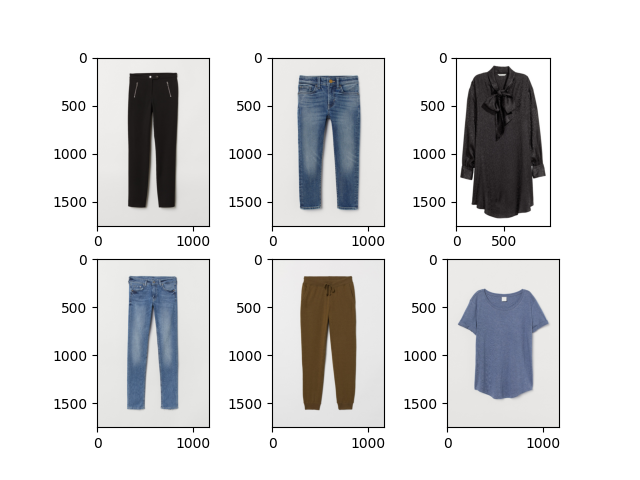

# Outfit Recommender
Group 40's CS 4641 Project: a clothing recommendation system.

Project by: Jackson Isenberg, Rishabh Jain, Rahi Kotadia, Adithya Vasudev, and Vivek Vijaykumar

Video Link: https://www.youtube.com/watch?v=y5HWehGLPQU

Website Link: https://adithya-gv.github.io/outfit-recommender/

## Introduction
Clothing shopping is a frequent occurrence, yet it remains a difficult and personal decision. Given our history of shopping and the characteristics of clothing items, we believe that automation and machine learning have the power to boost our decision making. There are many technologies targeting the fashion industry, usually leveraging data about customer habits and product appearances to make smart recommendations. Not only can having some assistance reduce the time commitment and mistaken purchases consumers may have, but also increase positive reviews and reduce return costs for companies.

### Background
Recommendation systems using visual, linguistic, or tabular data are a well-researched area. The popular approach is image-centric. This entails incorporating color, shape, and other visual cues to recommend either similar clothing or complementary pieces of fashion to a given product via Neural Networks [1,2]. Another popular technique utilizes NLP (Natural Language Processing) to help identify, cluster, and recommend clothing based on the names and descriptions of various products [3]. Other sources have worked with multi-label classification for clothing or data from professional stylists to better recommend specific clothing fashion to customers [4], but these diverge from our main focus.

## Problem Statement

### Motivation
The motivation of our project is to bring recommendation system algorithms to an area of shopping that is highly personal and varied: clothes shopping. A secondary motivation was to go beyond simple analysis of purchasing data and use data intrinsic to the clothing and users to provide recommendations that target the user's specific features. While other recommendation models may predominantly use an individual consumer's history of transactions, ours seeks to use the clothing itself.

### Our Problems

Our problem is twofold. 
1. Measure the similarity between two arbitrary pieces of clothing and use this measurement to construct groupings of similar clothings. 
2. Construct a recommender system that will recommend clothing based on a clothing item that a customer has purchased.

## Dataset Overview
The dataset we plan to use is the H&M clothing purchase history dataset (https://www.kaggle.com/c/h-and-m-personalized-fashion-recommendations/overview). The dataset has over 1 million logged clothing transactions, each attributed to a given ID representing a distinct person. The dataset also has metadata for clothing and images of each clothing item. However, the dataset is extremely large and it would not be viable to run clustering on the entirety of the data due to our computation limitations. Because of this, we have limited the dataset to around the first 35,000 of the 100,000 images of clothing. Since the entire dataset is split into 95 folders each of which have a random sample of 
clothing variants, we use 35% of this dataset should ensure that we have every possible type of clothing to successfully build our clustering model. From the clustering model, we create and compare both a Neural Net and a Convolutional Neural Net in classifying the rest of the data. I.e, because we cannot run clustering on all of the image data, we use a clustering approach on 35,000 data points, then, using these as labels for that data, we train a neural net and CNN to predict the clusters of the rest of the data.

Figure 1: An example of data set clothing image

Figure 2: An example of data set clothing data

Figure 3: An example of customer data

## Methods
Each of the two subproblems within our overall problem has distinct approaches.

### Clothing Similarity

#### Data Pre-Processing
First, we selected a sample of 35,000 images from the dataset. Because images have vastly more features than we have computational power to process through, we used PCA to compress the images. We determined the number of features by choosing the minimal number of features needed to have 90% of recovered variance. We do this twice: once in grayscale and once in RGB. The compressed images are stored as .npy files.

#### Clustering and Labelling
We measured clothing similarity by applying a clustering algorithm over the features of each clothing item. We applied two clustering algorithms, K-Means Clustering and Agglomerative Clustering, to see which captures the shape of the data the best. 

First, we used the Elbow method on K-means to determine the optimal number of clusters. We used the distortion score (or Inertia, as Scikit Learn calls it) to evaluate the elbow.

Next, to evaluate which metric was better, we used two Clustering Evaluation Techniques, the Davies-Bouldin Index and Sillhouette Score. We ran each clustering algorithm 10 times on the same dataset to determine average values for each.

Using the clustering method with the better scores, we assigned the 35,000 images a label based on the cluster number.

### Recommender System (Stage 1: K-Nearest Neighbors)
To create the clothing recommender system, we used the purchase history of a customer and the clothing items in the purchase history. Using KNN, we trained a classifier on every clustered image. Using this, we determined the five closest clothing pieces to an input item based on Minkowski distance. This should help the customer identify items similar to what they have already purchased. Also, it uses the text based metadata of each image to do find these recommendations. 

### Recommender System (Stage 2: Neural Network-KNN Chain)
This variant of the recommender system uses the KNN trained in combination with a neural network to make recommendations. Using our clustering data, we trained a neural network to predict the clothing cluster of a given clothing item. We then used the KNN algorithm, trained on every image within a specific cluster, to determine the five closest clothing pieces, which we then output with a score indicating similarity, based on Minkowski distance. 

## Results and Discussion: Similarity Clustering
For the clustering part of the project, we first performed some data cleaning and pre-processing to make our downstream task easier to manage and faster overall. We first compressed/resized all our images to a smaller resolution of (250,250) before performing any operations on the images. PCA was next run on both RGB and grayscale images on around 30,000 images. The PCA image compression on RGB images resulted in 16 features used from the image to recover 90% accuracy, as shown in Figure 4.

The PCA image compression on grayscale images also resulted in 16 features used from the image to recover at least 90% variance, as shown in Figure 5.

K-means was run on 200 RGB images in order to generate a graph of inertia versus cluster count, as shown below. 

Based on the elbow curve, we decided to use 13 clusters as our optimal cluster count.

K-means with 13 clusters was then run for RGB images to generate labels for each datapoint. Agglomerative clustering was also run with 13 clusters and 16 features for images to generate equivalent labels.

K-means was then run on 200 grayscale images in order to generate a graph of inertia versus cluster count, as shown below. 

We then ran agglomerative and K-means with 15 clusters on all the grayscale images. The number of clusters may be higher because the features take into account the shape of the article of clothing more in PCA when the image is grayscale versus when the image is in RGB. The RGB clusters may have more similarity in color, but the grayscale may have more similarity in shape.

Finally, when picking between K-Means Clustering and Agglomerative Clustering, we compared the Davies-Bouldin Index and Sillhouette Scores for both algorithms.

For K-Means, we recieved an average Davies-Bouldin Index of 1.61, and an average Sillhouette Score of 0.21. 

For Agglomerative Clustering, we recieved an average Davies-Bouldin Index of 1.54, and an average Sillhouette Score of 0.26.

Therefore, we decided to use Agglomerative Clustering's labels for its superior performance in both metrics (lower Davies-Bouldin Index and higher Sillhouette Score), as well as its extremely low run-to-run variance. 

The clustering results can be seen in the results/data folder, which contains many .csv files. Each one contains the results of the clustering for that folder (as the images were all split into many folders). Note that we ran the clustering algorithm independently on each folder, as clustering 30,000 images at once is computationally infeasible. As a consequence of this, the clusters in each folder may represent different things. However, we can easily resolve this when feeding into the neural network because the data/articles.csv file contains a description of each image and its id. So we can map the description to each image and combine the clustering in this way. 

In addition to the csv files we have generated, we have created a script to generate examples of what the images in each cluster looks like. By simply running the src/cluster_visual_csv.py script,  a new folder at results/visuals will be created that will contain a pdf of the images in each cluster given a specified subdirectory and clustering method (kmeans or agglomerative). Some examples can be seen below in Figure 5 and 6.

Cluster made by K-Means clustering algorithm:

Cluster made by Agglomerative clustering algorithm:

Overall, our visual observations match up with our reported statistics (Davies-Bouldin Index and Sillhouette Score) and support the notion that on average, Agglomerative Clustering does a better job at putting like-clothing together in a group. K-Means also does fairly well, but there are several situations where many unrelated clothing items are in a cluster together. 

## Results and Discussion (Recommender System Stage 1: KNN)

Unfortunately, this algorithm did not perform particularly well. This is likely because it is essentially clustering the existing clusters, and since the clustering from Agglomerative and Kmeans wasn't particularly amazing, it's hard for KNN to find good matches. Also, KNN is using the text based features of each clothing item, and the groups for each category (such as blue vs. red or tops vs. bottoms) are not continuous. What this means is that if blue might be represented as group 56 and light blue as group 205, even though we know that these are close together, their distance will be far. As a result, the KNN accuracy score was about 35% as calculated by SKLearn. We think that it might be overemphasizing the importance of color, and also being thrown off by the distance of group numbers. Here are some examples of recommendations generated by the model, with the input image in the top left corner. 

Decent clustering:

Fairly bad clustering:

Notice how the items are all of different item classes, but of mostly similar colors. 

## Results and Discussion (Recommender System Stage 2: Neural Network-KNN Chain)

Unfortunately, the neural net version also performs poorly because our existing clustered data was not very accurate to begin with (from kmeans/agglomerative). Thus, the neural net amplifies the problems in the orignal clustering since it uses these cluters as labels to train the model, meaning that it reinforces the poor patterns in the clustering. It had an accuracy of between 55% and 62% depending on the cluster, and while this seems higher than the result for regular KNN, keep in mind this is on top of the clustering accuracy. So the true accuracy is lower than the KNN accuracy from stage 1. 

Here is a set of predictions that isn't too bad (again with the input image in the top left corner):

The shirt is a good prediction here, but the sunglasses not so much.

## Conclusion

We set out to identify similiarities in a large dataset of images and build a recommender system to predict clothing based on purchased clothing. This is a difficult task because there are a large number of features associated with a piece of clothing, and a customer may purchase clothing arbitrarily. The structure of the data also makes it difficult to train a neural network to do the recommendations [WHY I DONT KNOW LOL]. The recommendation system may be of marginal use to a customer looking to find new clothing to purchase, however, customers don't necessarily just want to buy similar clothing - they want a flexible wardrobe. With future work we could use an autoencoder for better recommendation results, or a CNN on the actual images themselves. We weren't able to use the CNN we had initially discussed because it was far too computationally expensive on the huge amount of data we had. 

## References

1.  "Aesthetic-based Clothing Recommendation" (https://arxiv.org/pdf/1809.05822.pdf)  - International World Wide Web Conference (WWW)
2. "Image Based Fashion Product Recommendation with Deep Learning" (https://arxiv.org/pdf/1805.08694.pdf) 
3. "Towards Fashion Recommendation: An AI System for Clothing Data Retrieval and Analysis" (https://www.ncbi.nlm.nih.gov/pmc/articles/PMC7256565/) - IFIP International Conference on Artificial Intelligence Applications and Innovations (AIAI)
4. "Understanding Professional Fashion Stylists’ Outfit Recommendation Process: A Qualitative Study" (https://www.researchgate.net/publication 350315907_Understanding_Professional_Fashion_Stylists'_Outfit_Recommendation_Process_A_Qualitative_Study)

